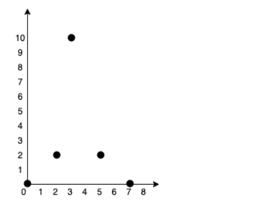
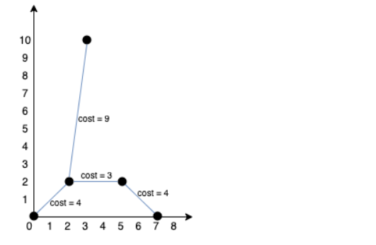

# Optimal Water Pipeline Network Design for a Residential Society Using Minimum Spanning Tree Algorithms

## Project Description
In this project, we aim to design a water pipeline network for a residential society, represented as a collection of houses on a 2D plane. Each house is a unique point on this plane, defined by its coordinates. The goal is to construct a water pipeline system that connects all the houses with the minimum possible cost. The cost to lay a pipeline between two houses is based on the Manhattan distance between them, calculated as:

**Cost = |x₁ − x₂| + |y₁ − y₂|**

To achieve this, we determine the Minimum Spanning Tree (MST) for the network, connecting all houses with the least total pipeline cost while ensuring water reaches every house without redundant connections.

### WebAssembly Integration
This project leverages **WebAssembly (Wasm)** to optimize performance-critical components of the application, particularly the MST calculation algorithms. By compiling key parts of the program (written in C++) to WebAssembly, we achieve:
- **Cross-Browser Compatibility**: Ensuring the application runs seamlessly in modern browsers.
- **High Performance**: Enhancing the speed of complex computations, such as finding MSTs using Prim's and Kruskal's algorithms.
- **Interoperability**: Enabling integration between JavaScript (frontend) and C++ (backend logic).

WebAssembly is used to process large graph data efficiently, ensuring real-time performance even for extensive residential societies.

## Methodology
We use two MST algorithms to find the optimal pipeline layout:

1. **Prim's Algorithm**: Constructs the MST by starting from an arbitrary node and expanding the tree by repeatedly adding the nearest vertex not yet in the tree. This is well-suited for dense graphs.

2. **Kruskal's Algorithm**: Builds the MST by sorting all edges by their weights and adding edges one by one to the MST, ensuring no cycles form. Kruskal’s algorithm is efficient for sparse graphs and uses a Disjoint Set Union (DSU) structure for cycle detection.

Both algorithms are implemented and benchmarked to evaluate their performance.

## Objectives
1. **Calculate MST Using Prim's and Kruskal's Algorithms**:
   Implement both algorithms to find the MST of the residential society’s graph.
   
2. **Compare Efficiency and Cost**:
   - Measure and compare the total cost of the pipeline network generated by each algorithm.
   - Compare the execution times of both algorithms to determine which performs better for this problem scenario.
   
3. **Leverage WebAssembly**:
   Utilize WebAssembly to execute MST algorithms with high performance and integrate results into the web-based visualization.

4. **Select Optimal Solution**:
   Based on the comparison, select the MST with the minimum cost and better efficiency as the final solution for the pipeline layout.

## Visualizations

  
  

- The left image represents the initial problem, while the right image illustrates the optimized pipeline network.

---

### Additional Notes
By using WebAssembly, this project bridges the gap between computational efficiency and web-based accessibility, making it suitable for both research and practical implementation in real-world scenarios.
